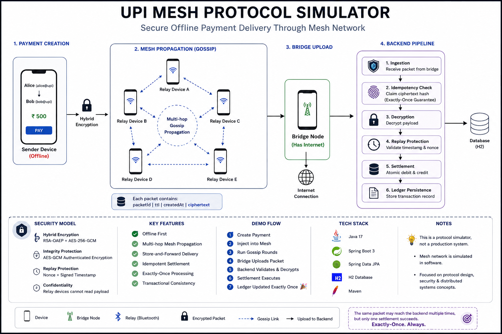

```

```

## Architecture Overview


```
# UPI Mesh Protocol Simulator

A Spring Boot based prototype that demonstrates secure offline payment delivery through a Bluetooth-style mesh network.

This project explores how encrypted payment packets can propagate across nearby devices without internet access and eventually settle once any bridge node regains connectivity.

The system focuses on:
- secure multi-hop packet delivery
- idempotent settlement
- replay protection
- transactional consistency
- distributed-system reliability concepts

---

# Problem Statement

Traditional UPI systems require direct internet connectivity between sender and bank.

This prototype explores an alternative model where payment packets propagate through nearby devices until an internet-enabled bridge node uploads them to the backend.

```text
Sender Device
    ↓
Nearby Relay Devices
    ↓
Internet-enabled Bridge Node
    ↓
Settlement Backend
```

The goal is not to replace real UPI infrastructure, but to explore:

*  mesh-routed deferred settlement 
*  secure untrusted relay transport 
*  exactly-once settlement under unreliable connectivity 
Core Engineering Concepts

*  Distributed Systems 
*  Store-and-Forward Networking 
*  Hybrid Cryptography (RSA-OAEP + AES-GCM) 
*  Idempotency 
*  Concurrent Settlement Handling 
*  Replay Protection 
*  Transactional Consistency 
*  Optimistic Locking 
*  Multi-hop Mesh Propagation 
System Architecture

```

```


```
PaymentInstruction
    ↓ encrypt
MeshPacket
    ↓ gossip propagation
Relay Devices
    ↓ upload
Bridge Node
    ↓
BridgeIngestionService
    ↓
SettlementService
    ↓
Ledger Persistence
```

How the Protocol Works
Step 1 — Payment Creation
A sender creates a `PaymentInstruction` containing:

*  sender VPA 
*  receiver VPA 
*  amount 
*  nonce 
*  signed timestamp 
Step 2 — Encryption
The payload is encrypted using hybrid cryptography:

*  RSA-OAEP encrypts the AES session key 
*  AES-256-GCM encrypts the payment payload 
Relay devices cannot read or modify the payment contents.
Step 3 — Mesh Propagation
The encrypted payload is wrapped inside a `MeshPacket`.
Packets propagate across nearby virtual devices through a gossip-based forwarding mechanism.
Each hop decreases packet TTL.
Step 4 — Bridge Upload
Once a bridge node regains internet connectivity, it uploads the packet to the backend.
Step 5 — Backend Validation Pipeline
`BridgeIngestionService` executes:

1.  Ciphertext hashing 
2.  Idempotency claim 
3.  Payload decryption 
4.  Replay/freshness validation 
5.  Atomic settlement 
Step 6 — Settlement
`SettlementService` performs:

*  sender debit 
*  receiver credit 
*  transaction persistence 
inside a single database transaction.
Security Model
Confidentiality
Payment payloads are encrypted using:

*  RSA-OAEP 
*  AES-256-GCM 
Intermediate relay devices cannot inspect transaction data.
Integrity Protection
AES-GCM provides authenticated encryption.
Any ciphertext tampering causes decryption failure.
Replay Protection
Each payment contains:

*  nonce 
*  signed timestamp 
Old or duplicated packets are rejected before settlement.
Exactly-Once Settlement
The backend hashes ciphertext and atomically claims it using the idempotency layer.
Even if multiple bridge nodes upload the same packet concurrently:

*  only one settlement succeeds 
*  remaining deliveries are rejected as duplicates
